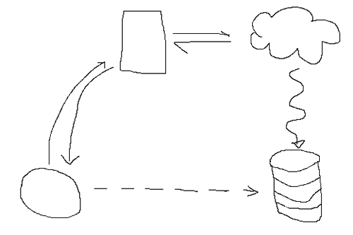

_Zu den [Abgabe-Requirements](doc/requirements.md)_

_**Reminder**: Zur Abgabe gehört auch ein Screencast in beliebiger Qualität und eure `.env` Files (und `config.h`, falls
  nötig)._

#Trockenobst

Erklärung des Projekts in ein paar Sätzen. Eventuell Foto, Logo, Screenshot, etc.

# Run

Kurze Erklärung für Außenstehende, was zu tun ist, um das System zum Laufen zu bringen.

# Projektaufbau

* verteiltes System etc. Ablauf skizzieren, beschreiben. Welche Services / Module gibt es?
* begründen, warum der Aufbau so ist

Danach jeden Service bzw. jedes Modul einmal kurz beschreiben:

## Sensor-Modul

* Beschreibung
* Skizze oder Foto, wie die Sensoren aussehen sollen bzw. aufgebaut sind.
* Wo / wie und von wem werden sie installiert / montiert?

## Dasselbe für jeden weiteren Service...

* Software-Komponenten benötigen kein Bild (außer es macht Sinn)
* interessant und wichtig ist prinzipiell die Begründung, warum ihr welche Kommunikationstechnologie, welchen Dienst,
  welche Hardware etc. verwendet habt.
* Beschreibung von API / Endpunkten (nicht total in-depth, man sollte nur sehen, was ein Service prinzipiell so kann)

# Weitere Features / Überlegungen

Hier könnt ihr einen Absatz für jedes Feature anlegen, der über die Must-Haves hinausgeht. Z. B. Überlegungen für die
Energieversorgung: Wo kommt euer System zum Einsatz? Braucht man Akkus und Solarzellen? Wie lange müssen die halten? Wie
habt ihr euer System angepasst, damit der Strom ausreicht, etc. Begründungen sind interessant.

# Skalierung

Ein Blick in die Zukunft. Was passiert, wenn man 1000 Sensoren hat? Wenn man 1000 User mit je 1000 Sensoren hat? Eine
Million? Was für neue Herausforderungen entstehen durch das Wachstum des eigenen Systems und wie sind die im Aufbau
berücksichtigt? Was wird zusätzlich nötig? Wie muss sich evtl. der Aufbau irgendwann ändern? Welche Komponenten ändern
sich, welche müssen ersetzt werden?

# About

wer was wie wo, HfG, SWEAVS, etc. Eigenen, vollen Namen mit dazu schreiben bitte.

